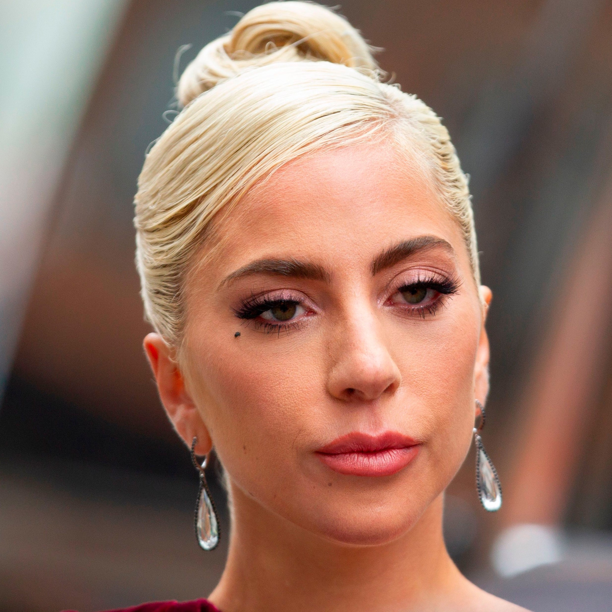
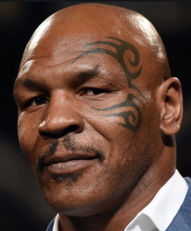
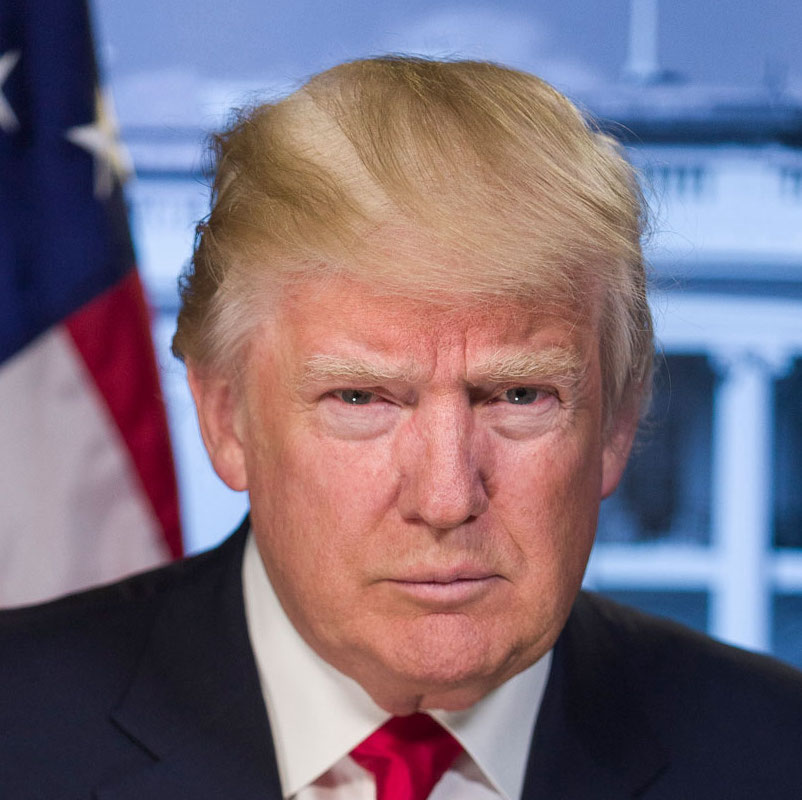
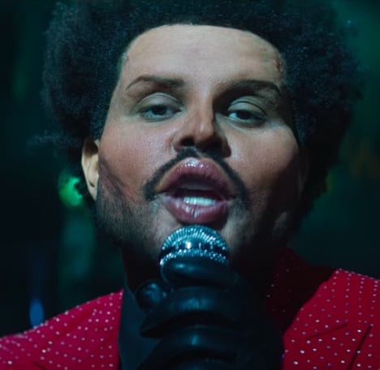
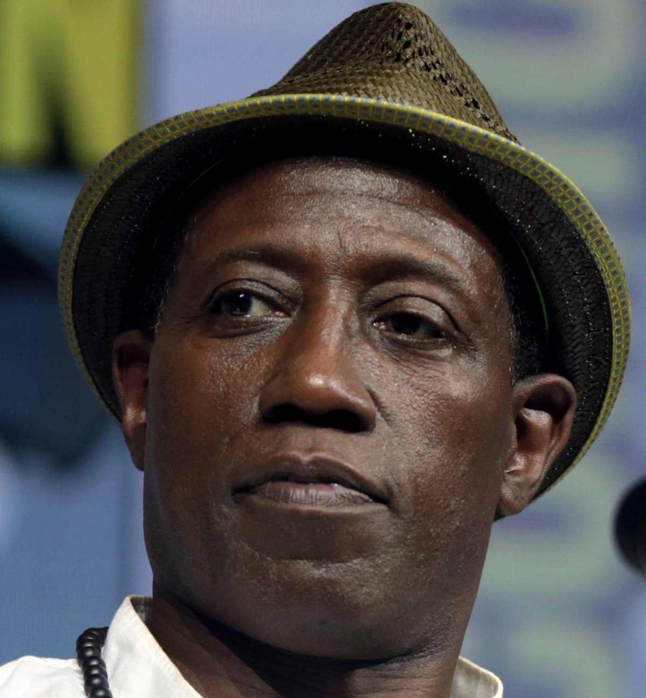
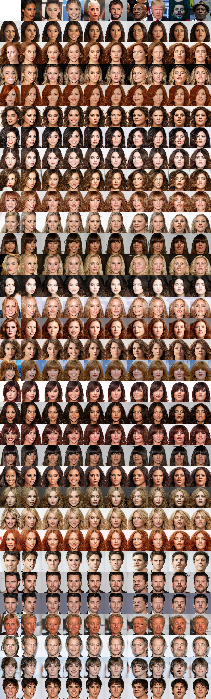

# CS585-Style-Transfer-GAN

## Table of Contents

1. [Introduction](#introduction)
2. [Running](#running)
3. [Data](#data)
4. [Neural Style Transfer](#neural-style-transfer)
5. [StarGAN](#StarGAN)

## Introduction

Neural style transfer is an optimization technique used to take two images - a content image and a style reference image (such as an artwork by a famous painter) - and blend them together so the output image looks like the content image, but “painted” in the style of the style reference image.

This is implemented by optimizing the output image to match the content statistics of the content image and the style statistics of the style reference image. These statistics are extracted from the images using a convolutional network.

## Running:
To run the notebook, please clone this repository, start a Jupyter notebook server in the correct directory, and open the notebook called `style_transfer_gan.ipynb`.  This notebook also contains code for a tutorial on how style transfer works;  the code for the data in this repo is interspersed throughout.

To see the StarGan code, please open the notebook called `StarGAN_v2_celeb_face_synthesizer.ipynb`.

## Data:
The art styles we used can be found in the folder `art-styles` and include the following:
* Classicism
* Contemporary
* Cubism
* Expressionism
* Fauvism
* Modern art
* Pop art
* Renaissance
* Romanticism
* Surrealism

We used three celebrity faces for the original style transfer notebook: `celebrity-faces/male/the-weeknd.jpg`, `celebrity-faces/male/wesley-snipes.jpg`, and `celebrity-faces/female/lady-gaga.jpg`.

For the StarGAN notebook, we used a selection of photos from the Celeb A-HQ dataset. These are the remaining photos in the `celebrity-faces/` directory.

## Neural Style Transfer
This section will explore the work in `style_transfer_gan.ipynb`.  To understand how neural style transfer performs on different faces, we fed multiple content images (faces) through our model and selected three that we decided would provide enough difference in skin tone and facial structure.  For each face, we used all 10 of the art styles listed above as our style reference images. The general trend we noticed was that styles that were more similar to the person's face and their image backgrounds produced better results than styles that were very different.

For The Weeknd, we chose an image taken after he had undergone plastic surgery, thereby giving him a significantly different facial structure.  In his case, we saw that styles that were equally different from the norm, like cubism or surrealism, produced better results than a style like classicism (see below).

 

*Surrealism vs. Classicism results on The Weeknd's face*

Similarly, because Wesley Snipes's skin tone is darker and the colors in the background of his original image are also more muted, styles with similar tones were more accurate. Compare the results of cubism and fauvism below: 

 

*Cubism vs. Fauvism results on Wesley Snipes's face*

Lady Gaga's results, however, were far more even across the board. Most of the styles were still able to capture some details of her face without incurring too much loss. As you can see, fauvism - which did not work as well with Wesley Snipes's face - works much better here. 

 

*Fauvsim vs. Classicism results on Lady Gaga's face*

There are many reasons that Lady Gaga's face could have produced better results in general, but a likely explanation is the data that was used to train the style transfer model.  If the model was provided more white faces in training, it will likely perform better with white faces in testing.

## StarGAN
This section will explore the work in `StarGAN_v2_celeb_face_synthesizer.ipynb`.
[StarGAN v2](https://github.com/clovaai/stargan-v2), the image translation model developed by Clova AI learns the mapping between different images. We used a  Star GAN network pre-trained with the CelebA-HQ dataset as well as a set of celebrity faces across different genders, skin tones, facial features and facial/body modifications (tattoos, and plastic surgery) as our source image dataset, and the CelebA-HQ dataset as our reference image dataset. Our source dataset was split into two domains: female and male

The following is a list of source images we chose to synthesize.

### Domain: Female

Rochelle Humes             |  Ariana Grande            |    Lady Gaga     |    Jennifer Lawrence
:-------------------------:|:-------------------------:|:------------------------:|:------------------------:|
 |   |  |  

### Domain: male
Chris Hemsworth             |  Mike Tyson        |    Donald Trump               |    The Weeknd     |    Wesley Snipes
:-------------------------:|:-------------------------:|:------------------------:|:------------------------:|:------------------------:|
 |   |  |   | 

We transformed all selected images by cropping the image to a ratio as approximately 1:1  as possible, with the face at the center, and occupying a large portion of the image. We then finetuned the image for additional fine rotation and cropping using the built-in tool provided by Clova AI . 
Finally,we fed these finetune images to the pretrained StarGAN network and generated synthesized output images. 

### Results

Our results showed that 
Distinct facial features such as strong jawlines and lips were propagated across different genders and skin tones into the generated/output images.
For faces like The Weeknd’s that have undergone facial modifications (e.g. plastic surgery) We noticed these features also remained distinct in the generated images. However the generated images weren’t so realistic
As expected, high-level features such as hairstyle, makeup, beard and skintone are followed from the reference images. However other features such as tattoos seemed to be preserved from the source image
Similarly, The model preserved the pose and identity of the source images in most output images

The result of our expriement is shown below
 